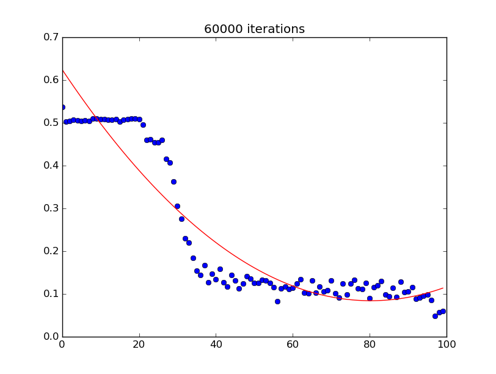
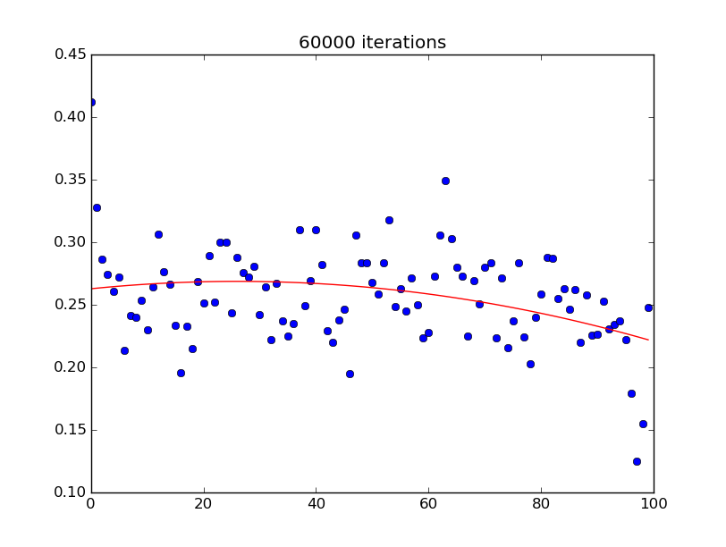

#MNIST Digit Recognition
---
FeedForward Neural Network with Bias Neurons,
Implemented using Armadillo Library

Topology : 28X28 - 75 - 10
20 Training Sessions
91% Accuracy on MNIST test data

---

Learning Curve Comparison (28x28, 15, 10):

AdaDelta

Plain

